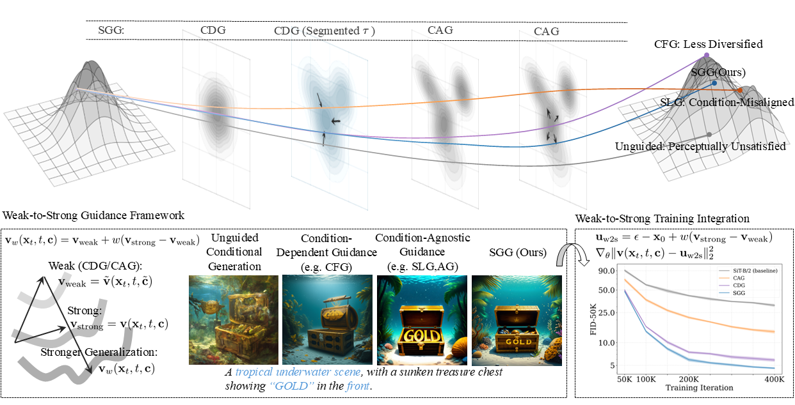

# Segmented Guidance (SGG) in Diffusion



**Improving Diffusion Generalization with Weak-to-Strong Segmented Guidance**

https://arxiv.org/abs/2603.20584


For **toy example** used in this work, please refer to https://github.com/851695e35/Leaves_Toy

## Requirements

Install dependencies from repo root:

```bash
pip install -r requirements.txt
```

## SD3/3.5 Sampling

`sd3` contains:

- `sd3_pipeline.py`: segmented-guidance pipeline implementation.
- `sample.py`: unified CLI sampler for both SD3 and SD3.5.
- `sample_loop.py`: unified CLI sampler for both SD3 and SD3.5 in the loop.

Use the unified sampler in `sd3/sample.py`.

```bash
python sd3/sample.py \
  --model sd35 \
  --model-path /path/to/sd35 \
  --prompt "A storefront with 'Text to Image' written on it." \
  --use-segmented-guidance \
  --guidance-scale 4.5 \
  --cfg-guidance-start 1 \
  --cfg-guidance-end 14 \
  --skip-layer-guidance-scale 3.0 \
  --skip-layer-guidance-start 15 \
  --skip-layer-guidance-end 28 \
  --output-dir outputs/sd35
```

CFG-only baseline example:

```bash
python sd3/sample.py \
  --model sd35 \
  --model-path /path/to/sd35 \
  --prompt "A storefront with 'Text to Image' written on it." \
  --guidance-scale 4.5 \
  --output-dir outputs/sd35
```

For SD3, keep the same command and switch `--model sd3` with an SD3 model path.


### Qualitative comparison


## SiT Training

### Training

Use the compact scripts under `sit/scripts`:

```bash
cd sit
DATA_DIR=/path/to/imagenet256 \
OUTPUT_DIR=./exps \
MAX_TRAIN_STEPS=400000 \
./scripts/train_segmented.sh
```

Supported guidance types:

- `None` (Baseline)
- `Uncond` (Model Guidance)
- `Segmented` (SGG)
- `LayerSkip` (SLG)
- `Branch ` (BR)
- `Separate` (AG)

Examples:

```bash
./scripts/train_none.sh # baseline
./scripts/train_uncond.sh # MG
./scripts/train_segmented.sh # SGG
./scripts/train_layerskip.sh # SLG
./scripts/train_branch.sh # BR
./scripts/train_separate.sh # AG
```


### Evaluation

Following REPA and ADM, you can first generate samples with `sample.sh`, then refer to [ADM evaluation](https://github.com/openai/guided-diffusion/tree/main/evaluations) for FID/Inception Score.

```bash
cd sit
OUTPUT_DIR=./exps \
EXP_NAME=XXXXX \
CKPT_STEP=latest \
./scripts/sample.sh
```


### Notes on naming
We appreciate a reviewer for pointing out a naming overlap with another interesting work in diffusion guidance research, [SEG](https://arxiv.org/abs/2408.00760). Since changing the conference title was not feasible, we use **SGG** to avoid confusion.


### Reference links

For running details one can refer to wandb project for references.

https://wandb.ai/liangyuy/w2sseg/reports/w2s-seg---VmlldzoxNjA2Nzk0Mg?accessToken=hu0pq3um4hgqge00uhxmx65hhsxi1ik2nda9obmp7ut941hrphindexsflvdi8li


## Citation
```
@article{yuan2026improvingdiffusiongeneralizationweaktostrong,
      title={Improving Diffusion Generalization with Weak-to-Strong Segmented Guidance}, 
      author={Liangyu, Yuan and Yufei, Huang and Mingkun, Lei and Tong, Zhao and Ruoyu, Wang and Changxi, Chi and Yiwei, Wang and Chi Zhang},
      journal={arXiv preprint arXiv:2603.20584},
      year={2026},
}
```


## Contact

If you have any problem or suggestions, feel free to contact liangyuy001@gmail.com.
